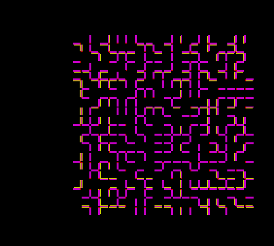

Maze<br>
====
A simple gl maze in go<br>
<br>
Getting this to go run is easy:<br>
<br>
`apt-get install golang libglew1.6-dev pkg-config libsdl1.2-dev libsdl-image1.2-dev libsdl-mixer1.2-dev`<br>
`go get github.com/banthar/Go-SDL/sdl`<br>
`go get github.com/go-gl/gl/v2.1/gl`<br>
`go run main.go`<br>

#### Keys
```
i: zoom in
o: zoom out
escape: exit
UP: + rotate x
DOWN: - rotate x
LEFT: + rotate y
RIGHT: - rotate y
z: - rotate z
shift + z: + rotate z
w: + translate z
s: - translate z
d: + translate x
a: - translate x
q: + transalte y
e: - translate y
```




====

note: does not run well on macosx atm

